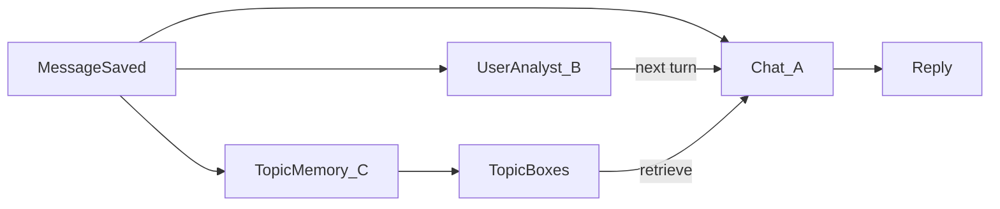
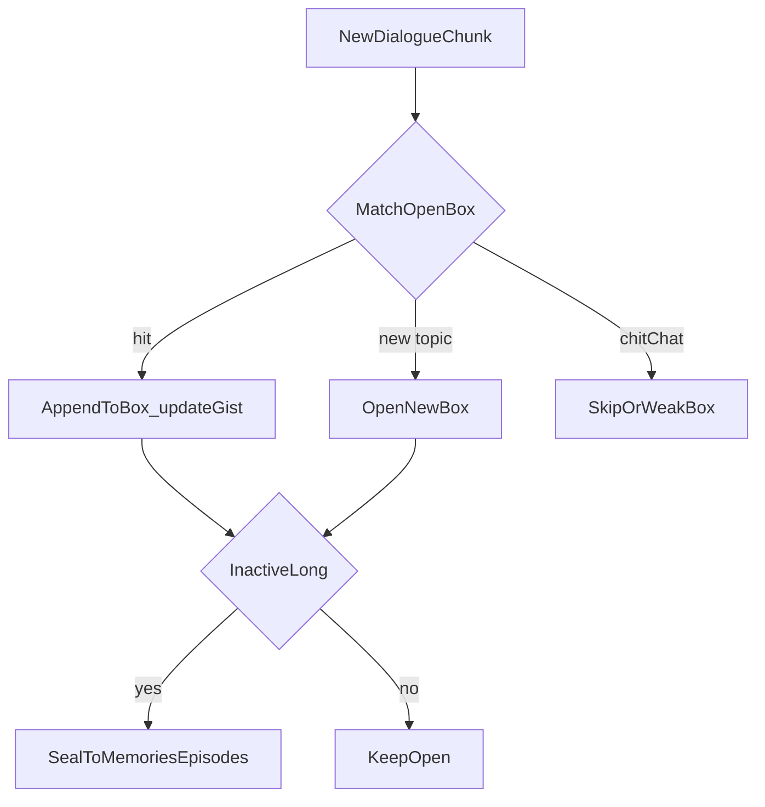

# A / B / C 并行车道设计

> 状态：设计稿（尚未落地实现）  
> 目的：把「聊天扮演」「用户情绪与习惯」「话题记忆」拆成三条互不等待的车道，减轻按轮总结的重复冲突，并让拧巴/反常能在下一轮被角色接住。

---

## 1. 总览

| 车道 | 职责 | 何时影响聊天 |
|------|------|----------------|
| **A** | 扮演角色、生成回复；保留**角色自己的心情** | 当轮 |
| **B** | **用户**情绪、拧巴/潜台词、聊天习惯 | **下一轮**短提示（不挡当轮回复） |
| **C** | 记忆：按话题分框追加，不按轮数切窗总结 | 检索相关框进 prompt；不挡回复 |

- A **不 await** B / C。
- B、C 使用**独立上下文**：不塞人设卡、世界书、工具说明等。
- 用户消息落库后立刻分叉；B/C 异步跑。



---

## 2. 为什么要拆

### 现在的问题（摘要）

- 用户情绪/习惯：聊天模型 A 上下文里虽有感知与画像，但**没有**「平时夜里话密 vs 今晚偏少」这类多日基线；拧巴若无显性词，A 也容易漏。
- 记忆：按助手轮数（如每 12 轮）切窗总结，易**重复、冲突**；东一句西一句时，硬切时间窗不适合。
- 「用户家：…」一类常驻注入会让角色误以为人总在家（已另案改掉）；用户侧状态更适合由专用分析车道维护。

### 目标形态

- A 专心演戏与回复。
- B 专管「对方现在怎样 / 平时怎样」。
- C 专管「聊过哪些话题框，怎么长、何时收束」。

---

## 3. Token 与费用

### 3.1 模型不吃全量

一个模型窗口装不下「全天聊天 + 全画像 + 全部话题框」。设计上**禁止**这么喂。

| 层 | 吃什么 | Token |
|----|--------|-------|
| **规则层（零模型）** | 全天/多天：时间戳、字数、条数、间隔 | 不占 LLM 窗口 |
| **B 模型每次** | ① 已沉淀习惯/情绪状态摘要（短）② 最近 N 回合对话近窗 | 固定预算（例：状态 1～2k + 近窗 8～20k） |
| **C 模型每次** | ① 开放框**目录**（标题+一行 gist+id）② 命中的 1～2 个框的 gist ③ 本段新对话 | 目录很小；框全文不进 |
| **夜间** | 日切片 / 框摘要再巩固 | 仍是摘要，不是全天原文 |

说明：

1. 「近窗可以比 A 长」是因为 B/C 不带人设工具，**不是无限长**。
2. 「习惯看整天」靠**规则扫库**，不靠 B 读整天原文。
3. B 与 C **分次调用**，不塞进同一超大 prompt。
4. 画像成熟后 B **降频**。

### 3.2 会不会变成 3 倍 API？

**不是「A 用量 ×3」。**

| 部分 | 相对现在 |
|------|----------|
| **A（聊天）** | 差不多，甚至略少（少塞用户情绪热块；记忆改检索话题框） |
| **B** | **新增**，但每次上下文远小于 A；可防抖、成熟后降频 |
| **C** | **替换**现有按轮记忆总结，不是纯叠加；每次也远小于 A |
| **规则层** | 不花 LLM token |

量级感（非精确）：

- B、C 每条都打满近窗 → 总账大约 **1.5～2.5×** 现在  
- 防抖 + 成熟降频 + B/C 用更便宜模型 → 大约 **1.3～1.8×**

控费默认：规则优先；B/C 防抖；成熟降频；B/C 可用便宜模型；禁止 B/C 吃 A 同款大上下文。

---

## 4. 车道 B：用户情绪与聊天习惯

### 4.1 职责

- 接管原「用户情绪」热路径（对方高不高兴、拧不拧巴、有没有话没说）。
- 维护聊天习惯：偏好时段、话量、与基线的偏离（如平时夜聊密、今晚明显少）。
- **角色自己的心情**仍留在 A（`emotion-helper` 角色侧），不拆给 B。

### 4.2 输入

- 极短 system（分析器，不扮演角色）。
- 已沉淀状态摘要（JSON/短文）。
- 滚动近窗：**用户 + 角色**回合（分析「什么样的人 / 互动习惯」不能只吃用户单边）。
- **不吃**：人设卡、世界书、工具、手机能力说明。

### 4.3 是不是每轮都分析？

**不是。**

| 层 | 频率 | 做什么 |
|----|------|--------|
| **规则** | 几乎每条用户消息 | 更新时段/话量/间隔等；**不调模型** |
| **B 模型** | **抽样 / 防抖**，非每轮必调 | 近窗做情绪/拧巴/习惯增量 |

默认触发（可调）：攒满 2～3 个完整回合；或规则已标异常；或夜间巩固。

近窗里会带角色回复当上下文 ≠ 每轮回复都跑一次 B。

### 4.4 下一轮怎么递给 A

1. 当轮：用户消息落库 → A 照常回（不 await B）。
2. B 异步写入：`user_mood` / `subtext` / `habit_anomaly` + `pending_for_a`。
3. **下一轮**拼 A 的 system 时消费 pending，例如：  
   `【对方状态】可能有点拧巴/不太开心（依据摘要）。要不要管看你。`  
   `【对方习惯】今晚话量明显低于平时夜聊。`
4. 注入后清除或标已读，避免每轮重复。

不做：当轮改已发出的回复；强迫 A 等 B。

### 4.5 拧巴 / 没说出口的情绪

B 针对**近窗上下文**判断「不对劲 / 拧巴 / 有话没说」，不靠关键词唯一路径。

| 情况 | B 能否察觉 |
|------|------------|
| 平淡，但与平时或今晚前半段有反差 | 有机会 |
| 平淡，但近窗语义本身拧（欲言又止、情绪被抹平等） | 有机会 |
| 一贯平淡、近窗也无反差、零痕迹内耗 | **基本上不能** |

A 侧「漏接后当场补救」本期不做；靠下一轮 pending + 画像成熟后 A 更敏锐。

### 4.6 画像何时「成熟」

不是绝对画完，而是置信度成熟（消息量 / 跨天数够）。

- **稳定层**（性格底色、大体聊天类型）：少改。  
- **流动层**（近况、今晚气氛）：继续更新。  
成熟后 B 降频值班；规则继续盯反常。

### 4.7 夜间交班

日间 B 维护客观 store → 夜间压缩交班稿 → 消化进角色侧印象（「我眼里的你」）。  
客观习惯（B）与角色主观判断（现有 user-read / 印象）分表，避免打架。

---

## 5. 车道 C：话题记忆分框

### 5.1 要解决什么

当前按轮 `generateMemorySummary`（约每 N 个助手轮切窗）：

- 易重复、冲突；
- 窗内最多拆几个 topics，仍是**时间窗切片**，不是持久开放话题；
- 下游 embedding 聚类是事后补救。

目标：东一句西一句时——

- 话题1 → 框1  
- 岔到话题2 → 框2  
- 再聊回话题1 → 再塞进框1  

### 5.2 开放话题框

```
开放话题框 = {
  id, title/label,
  status: open | cooled | closed,
  gist,           // 滚动摘要
  bullets/facts,  // 可追加要点
  last_active_at,
  keywords / embedding
}
```

### 5.3 整理流程



1. **进来**：防抖后的一小段新对话 + 开放框目录（标题 + 一行 gist + id）。  
2. **归框**：并入已有 / 开新 / 闲聊丢弃；多框可同时 open。  
3. **框内生长**：追加要点 + 滚动 gist（非整窗重写）。  
4. **收束**：冷却或夜间 → 写入现有 `memory_episodes` / `memories`，归档框。  
5. **与按轮总结**：主路径改为活框追加；关键词/显著时刻可保留快路径。

### 5.4 C 是否必须单独模型？

- **和 A 必须分开**（异步、独立存储）。  
- **和 B**：逻辑分开；实现上可先共用同一次模型调用吐两份结果，耦合重再拆。  

默认：逻辑独立的 C（话题框 store + 路由）。

### 5.5 难点

- 路由偶发分错 → 合并/拆框 + 夜间整理。  
- 纯寒暄不要开框。  
- 框要有 gist/要点上限，冷却后落库，防止无限胀。

---

## 6. 落地顺序（建议）

1. **B store + 规则习惯统计 + fan-out 钩子**（不阻塞聊天）。  
2. **B 模型防抖分析 + pending → 下一轮注入 A**；弱化 A 侧原「对方的情绪」热计算。  
3. **C 话题框表 + 路由追加**；旁路按轮总结主路径。  
4. **夜间**：B 交班 + C 框整理/收束。  
5. 控费：防抖参数、便宜模型、成熟降频可配。

建议落点（实现时）：

- 钩子：`backend/server.js` 用户/助手消息写入后  
- B：新模块如 `habit-portrait-helper`（或等价命名）  
- C：新表 `memory_topic_boxes` + 收束进现有记忆表  
- A 注入：`buildSystemPrompt` / lived 组装处读 pending  

---

## 7. 明确不做的事

- A await B 或 C  
- 人设卡 / 工具堆进 B、C  
- B/C 每条吞全天原文  
- 宣称能稳定读出所有没说出口的情绪  
- 继续以按轮总结作为记忆主路径（目标由 C 取代）  
- 把角色自己的心情系统拆给 B  

---

## 8. 相关现状代码（对照用）

| 区域 | 路径 |
|------|------|
| 按轮记忆总结 | `backend/cron.js`（`maybeTriggerMemorySummary` / `generateMemorySummary`） |
| 用户情绪块 | `backend/user-read-helper.js`（`【对方的情绪】` 等） |
| 感知异常分 | `backend/perception-helper.js` |
| 角色心情 | `backend/emotion-helper.js` |
| 记忆落库/去重 | `backend/memory-brain-helper.js` |
| 事后叙事聚类 | `backend/memory-narrative-helper.js` |
| 夜间日子消化 | `backend/lived-day-helper.js` |

---

*本文档由设计讨论整理，实现前以产品确认为准。*
